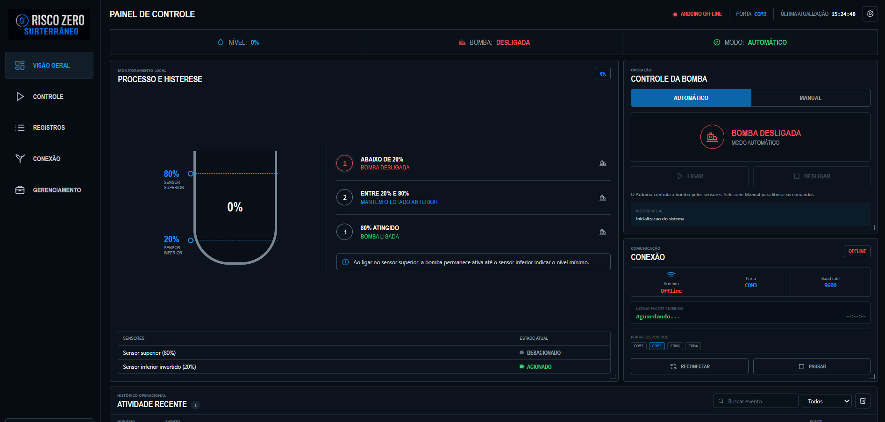

# Risco Zero Subterrâneo


Protótipo de supervisão e drenagem automática para demonstrar a prevenção de alagamentos em galerias elétricas subterrâneas. A inteligência de controle fica no Arduino; o painel web atua na supervisão, registro e operação assistida.

> **Nota de arquitetura:** este repositório contém a versão completa do painel, com supervisão serial, relatório, Telegram e previsão meteorológica.

<p align="center">
  
</p>

## Sumário

- [Visão técnica](#visão-técnica)
- [Arquitetura](#arquitetura)
- [Componentes e pinos](#componentes-e-pinos)
- [Lógica de controle e histerese](#lógica-de-controle-e-histerese)
- [Protocolo serial](#protocolo-serial)
- [Dashboard e API](#dashboard-e-api)
- [Alertas e previsão meteorológica](#alertas-e-previsão-meteorológica)
- [Estrutura do repositório](#estrutura-do-repositório)
- [Como executar](#como-executar)
- [Como gravar o Arduino](#como-gravar-o-arduino)
- [Segurança e publicação no GitHub](#segurança-e-publicação-no-github)
- [Limites do protótipo](#limites-do-protótipo)

## Visão técnica

O projeto separa o controle em duas camadas:

| Camada | Responsabilidade |
| --- | --- |
| **Controle local (edge)** | O Arduino lê as boias, mantém a memória de drenagem e comanda o relé da bomba. |
| **Supervisão web** | O Flask lê a serial, expõe os dados via API, registra eventos e atualiza o painel em tempo real. |

Essa separação é intencional. Se o navegador, o Flask ou a internet ficarem indisponíveis, a decisão de ligar e desligar a bomba continua acontecendo no Arduino, desde que ele permaneça alimentado e conectado aos sensores e ao relé.

## Arquitetura

```text
Boia inferior (nível seguro) ─┐
                              ├──> Arduino Uno ───> Relé ───> Bomba 5 V
Boia superior (nível crítico) ─┘        │
                                        │ USB Serial / 9600 baud
                                         ▼
                              Flask + PySerial
                                 │          │
                                 ▼          ▼
                           Dashboard     Telegram
                                           Open-Meteo
```

O Arduino é o único componente que participa da decisão crítica de drenagem. O servidor não substitui a lógica embarcada: ele recebe telemetria, registra eventos e envia comandos manuais quando autorizado.

## Componentes e pinos

| Item | Função | Conexão principal |
| --- | --- | --- |
| Arduino Uno | Controlador local | USB para o computador e pinos digitais para I/O |
| Boia inferior | Confirma o nível mínimo/seguro | `D2` e `GND` |
| Boia superior | Identifica o nível crítico | `D3` e `GND` |
| Módulo relé | Chaveia a alimentação da bomba | Entrada `IN` em `D8` |
| Mini bomba 5 V | Executa a drenagem | Fonte externa através dos contatos do relé |
| Fonte 5 V | Alimentação da bomba/relé | Dimensionada para a corrente da bomba |

### Observações elétricas importantes

- As boias usam `INPUT_PULLUP`: cada sensor fecha contato com o `GND` quando acionado. Portanto, a leitura elétrica `LOW` significa **sensor acionado**.
- O módulo utilizado é configurado como **relé ativo em nível baixo**. No código, isso está controlado por `releAtivoEmLow = true`.
- A bomba deve ser alimentada por fonte compatível com sua corrente. Ela não deve ser alimentada por pinos do Arduino.
- O negativo da fonte da bomba e o retorno do circuito devem ser montados com cuidado para evitar ruído e quedas de tensão. Em aplicações reais, use fonte isolada, proteção contra surtos e componentes industriais.

## Lógica de controle e histerese

O protótipo não trabalha com uma única condição para ligar e desligar. Ele usa dois pontos de decisão para evitar chaveamento repetitivo da bomba perto do limite.

```text
Nível crítico atingido (boia superior)  -> inicia a drenagem
Nível entre os sensores                  -> mantém o estado da drenagem
Nível seguro atingido (boia inferior)    -> encerra a drenagem
```

Essa técnica é chamada de **histerese**. Ela cria uma faixa de operação entre os sensores e impede que a bomba desligue logo após a água sair do sensor superior.

### Estado interno usado pelo Arduino

```cpp
bool drenagemAtiva = false;
bool manualWebAtivo = false;
bool bombaLigada = false;
```

`drenagemAtiva` funciona como memória do ciclo automático:

1. A boia superior é acionada e ativa `drenagemAtiva`.
2. Mesmo quando a boia superior deixa de estar acionada, `drenagemAtiva` continua verdadeira.
3. A boia inferior confirma o nível seguro e encerra `drenagemAtiva`.
4. A saída do relé é calculada por `drenagemAtiva || manualWebAtivo`.

O código de referência está em [`arduino/risco_zero_subterraneo/risco_zero_subterraneo.ino`](arduino/risco_zero_subterraneo/risco_zero_subterraneo.ino).

## Protocolo serial

O Arduino envia uma linha CSV a cada **500 ms**, usando **9600 baud**:

```text
boia_inferior,boia_superior,bomba,manual_fisico,manual_web
```

Cada campo é um booleano: `0` para falso/inativo e `1` para verdadeiro/ativo.

| Exemplo de pacote | Interpretação |
| --- | --- |
| `1,0,0,0,0` | Boia inferior acionada: nível seguro e bomba desligada. |
| `0,1,1,0,0` | Boia superior acionada: condição crítica e bomba ligada. |
| `0,0,1,0,0` | Água entre os sensores; a bomba continua ligada por causa da memória de drenagem. |
| `0,0,0,0,0` | Nenhuma boia acionada e nenhum ciclo de drenagem ativo. |
| `0,0,1,0,1` | Bomba ligada por comando manual vindo do painel. |

O Flask descarta qualquer linha que não tenha exatamente cinco campos binários. Isso evita que ruídos, mensagens incompletas ou caracteres inválidos atualizem o painel como se fossem telemetria válida.

## Dashboard e API

O backend usa Flask, PySerial e uma thread de leitura contínua. A interface faz polling em `GET /dados` a cada **1 segundo** na versão SCADA.

### Dados publicados pelo endpoint `/dados`

```json
{
  "level_percent": 80,
  "status": "CRITICO",
  "pump_on": true,
  "boia_inferior": false,
  "boia_superior": true,
  "serial_connected": true,
  "serial_port": "COM3",
  "last_serial_line": "0,1,1,0,0",
  "history": [],
  "logs": []
}
```

### Rotas disponíveis

| Método | Rota | Uso |
| --- | --- | --- |
| `GET` | `/` | Abre o dashboard SCADA. |
| `GET` | `/dados` | Entrega o estado atual, histórico e logs em JSON. |
| `POST` | `/ligar` | Envia o comando manual `1` para o Arduino. |
| `POST` | `/desligar` | Envia o comando manual `0` para o Arduino. |
| `POST` | `/conectar` | Retoma o monitoramento serial. |
| `POST` | `/desconectar` | Pausa o monitoramento serial no servidor. |
| `POST` | `/limpar_logs` | Limpa o buffer de eventos da execução atual. |
| `GET/POST` | `/gerenciamento/configuracoes` | Consulta ou salva as configurações de gerenciamento. |
| `POST` | `/gerenciamento/localizar_telegram` | Localiza o Chat ID após o comando `/start` no bot. |
| `POST` | `/gerenciamento/testar_telegram` | Envia uma mensagem de teste. |
| `GET` | `/gerenciamento/previsao?cidade=...` | Consulta a previsão via Open-Meteo. |
| `GET` | `/relatorio` | Gera uma página de relatório operacional. |

### Estados de conexão serial

O servidor tenta localizar a porta configurada em `SERIAL_PORT` e, quando habilitado, procura automaticamente dispositivos identificados como Arduino, USB Serial ou CH340.

Para evitar alternância visual causada por falhas pontuais, o estado de conexão usa:

- tolerância de `10` segundos após o último pacote válido;
- até `3` falhas seriais antes de consolidar a desconexão;
- tentativa periódica de reconexão pelo leitor serial em segundo plano.

## Alertas e previsão meteorológica

### Telegram

O monitor de alertas roda em uma thread independente e notifica uma vez por ciclo:

1. **Alerta crítico:** nível máximo atingido e bomba ativada.
2. **Drenagem concluída:** nível mínimo atingido e bomba desligada.

O token pode ser informado pela interface local ou pela variável de ambiente `TELEGRAM_BOT_TOKEN`. O Chat ID e as demais preferências ficam em `data/settings.json` durante a execução.

### Previsão meteorológica

O painel consulta a API pública Open-Meteo para estimar risco de chuva por cidade. A classificação atual é:

| Risco | Critério |
| --- | --- |
| Baixo | Menos de 20 mm e probabilidade abaixo de 60%. |
| Moderado | Pelo menos 20 mm ou probabilidade a partir de 60%. |
| Alto | Pelo menos 50 mm ou probabilidade a partir de 80%. |

As respostas são mantidas em cache por 30 minutos para reduzir consultas repetidas.

## Estrutura do repositório

```text
risco-zero-subterraneo/
├── README.md
├── .gitignore
├── .env.example
├── app.py                                # Backend, serial, Telegram e clima
├── main.py                               # Ponto de entrada do Flask
├── requirements.txt
├── iniciar_painel.bat                    # Atalho para inicialização no Windows
├── assets/
│   └── dashboard-operacional.png
├── arduino/
│   └── risco_zero_subterraneo/
│       └── risco_zero_subterraneo.ino
├── static/
│   ├── app.js                            # Atualização do painel e interações
│   ├── style.css
│   └── logo-risco-zero.png
├── templates/
│   ├── index.html                        # Dashboard
│   └── report.html                       # Relatório operacional
└── data/                                 # Criada localmente e ignorada pelo Git
```

## Como executar

### 1. Pré-requisitos

- Python 3.10 ou superior;
- Arduino IDE;
- Arduino Uno conectado por USB;
- Uma porta serial disponível, por exemplo `COM3` no Windows;
- Dependências Python de [`requirements.txt`](requirements.txt).

### 2. Criar e ativar ambiente virtual

No PowerShell, a partir da raiz do repositório:

```powershell
py -m venv .venv
.\.venv\Scripts\Activate.ps1
pip install -r requirements.txt
```

Caso o PowerShell bloqueie a ativação local, execute uma vez:

```powershell
Set-ExecutionPolicy -Scope Process -ExecutionPolicy Bypass
```

### 3. Selecionar a porta serial

Por padrão, o projeto usa `COM3`. Para informar outra porta apenas naquela sessão:

```powershell
$env:SERIAL_PORT = "COM4"
```

Também é possível manter a detecção automática habilitada e deixar o sistema procurar dispositivos Arduino, CH340 ou USB Serial.

### 4. Iniciar o painel

```powershell
python main.py
```

Abra no navegador:

```text
http://127.0.0.1:5000
```

Para acessar pelo celular na mesma rede Wi-Fi, use o IP local do notebook, por exemplo:

```text
http://192.168.0.10:5000
```

> O Windows pode solicitar permissão de firewall para o Python. Autorize apenas em redes privadas/confiáveis.

## Como gravar o Arduino

1. Abra [`risco_zero_subterraneo.ino`](arduino/risco_zero_subterraneo/risco_zero_subterraneo.ino) na Arduino IDE.
2. Em **Ferramentas**, selecione a placa Arduino Uno.
3. Selecione a porta COM do Arduino.
4. Feche o Monitor Serial e pare o Flask antes do upload, pois somente um programa pode usar a porta serial por vez.
5. Clique em **Carregar**.
6. Depois do upload, feche qualquer ferramenta que mantenha a porta aberta e inicie o painel Flask.

## Limites do protótipo

Este repositório é uma prova de conceito educacional. Para uma aplicação de campo, a solução deve evoluir para sensores industriais adequados ao ambiente, fontes protegidas, isolamento elétrico, painel certificado, proteção contra surtos, comunicação robusta, redundância, testes de falha e adequação às normas aplicáveis.

---
<p align="center">
  
</p>

Desenvolvido como projeto técnico de automação, sistemas embarcados e supervisão web.
